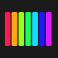
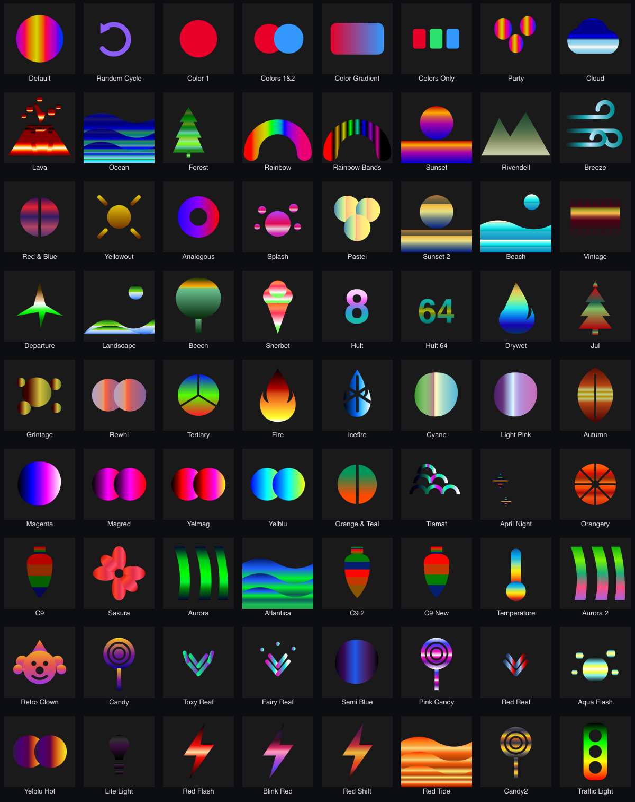
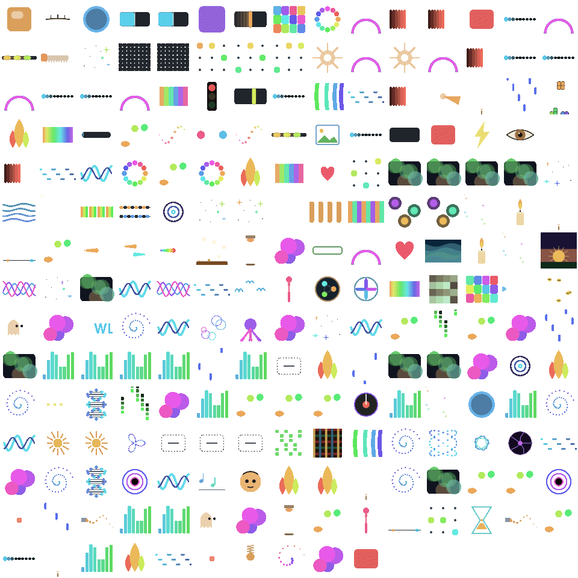

# wled-assets

**A shared, client-side asset layer for [WLED](https://github.com/wled/WLED)'s standard
palettes and effects: localized names, evocative palette illustrations, and effect motion
previews — for any WLED client to render.**

<table>
<tr>
<td width="50%" align="center" valign="top">
 
<b>Palette · Rivendell</b> 
The Elven valley from Tolkien's <i>Lord of the Rings</i> — misty mountains and forests. The palette's own gradient is poured into the silhouette.
</td>
<td width="50%" align="center" valign="top">
 
<b>Effect · Aurora</b> 
The full spectrum cycles through (the <i>rainbow</i> motion family). Every effect gets its <b>own</b> animation — hue, speed and density seeded by the effect.
</td>
</tr>
</table>

That's the idea in two tiles: a palette becomes a **telling illustration in its real colours**,
an effect becomes a **living preview of how it moves** — each with a **localized name and a
one-line description**. Below: all 72 palettes and all 220 effects at a glance.

 
<i>The 72 standard WLED palettes, each as its gradient-filled illustration.</i>

 
<i>The 220 standard WLED effects, each animated and visually distinct.</i>

## Why

WLED's effect and palette names are English identifiers, compiled into the firmware and
referenced by index (`fx:63`, `pal:11`). There is no official localization, and the
firmware can't carry translations or artwork without inflating the binary that ships to
every ESP. **This repo is the firmware-independent, client-side complement**: a single
source of truth that phone apps, web UIs, overlays and third-party tools can all consume
to show localized names, telling palette icons, and a preview of what each effect *does*.

> Not affiliated with the WLED project. WLED is an independent open-source project; this
> repo merely *interoperates* with its public enumerations. The join key is the exact
> English name returned by `/json/pal` and `/json/eff`. Everything falls back to that
> English name when a translation or asset is missing — so a consumer is never worse off
> than plain WLED.

## Browse the docs (GitHub-rendered)

One page per **language × concept** — English name · translation · description · illustration.
Full index: **[docs/](docs/)**. Or jump straight in:

| Language | Palettes | Effects | Controls | Colours | Nightlight |
|---|---|---|---|---|---|
| 🇬🇧 English | [palettes](docs/en/palettes.md) | [effects](docs/en/effects.md) | [controls](docs/en/controls.md) | [colours](docs/en/colors.md) | [nightlight](docs/en/nightlight.md) |
| 🇫🇷 Français | [palettes](docs/fr/palettes.md) | [effects](docs/fr/effects.md) | [controls](docs/fr/controls.md) | [couleurs](docs/fr/colors.md) | [nightlight](docs/fr/nightlight.md) |
| 🇩🇪 Deutsch | [palettes](docs/de/palettes.md) | [effects](docs/de/effects.md) | [controls](docs/de/controls.md) | [farben](docs/de/colors.md) | [nightlight](docs/de/nightlight.md) |
| 🇪🇸 Español | [palettes](docs/es/palettes.md) | [effects](docs/es/effects.md) | [controls](docs/es/controls.md) | [colores](docs/es/colors.md) | [nightlight](docs/es/nightlight.md) |
| 🇮🇹 Italiano | [palettes](docs/it/palettes.md) | [effects](docs/it/effects.md) | [controls](docs/it/controls.md) | [colori](docs/it/colors.md) | [nightlight](docs/it/nightlight.md) |
| 🇯🇵 日本語 | [palettes](docs/ja/palettes.md) | [effects](docs/ja/effects.md) | [controls](docs/ja/controls.md) | [色](docs/ja/colors.md) | [nightlight](docs/ja/nightlight.md) |
| 🇰🇷 한국어 | [palettes](docs/ko/palettes.md) | [effects](docs/ko/effects.md) | [controls](docs/ko/controls.md) | [색](docs/ko/colors.md) | [nightlight](docs/ko/nightlight.md) |
| 🇨🇳 中文 | [palettes](docs/zh/palettes.md) | [effects](docs/zh/effects.md) | [controls](docs/zh/controls.md) | [颜色](docs/zh/colors.md) | [nightlight](docs/zh/nightlight.md) |

## What's inside

| Path | What |
|---|---|
| `data/palettes.json`, `data/effects.json` | The reference WLED enum lists (English names, in index order). |
| `i18n/palettes.json` | Every palette → per language `{ name, desc }` (8 languages, English fallback). |
| `i18n/effects.json` | Every effect → per language `{ name, desc }` (`desc` = its motion family). |
| `i18n/controls.json` | The standard effect **controls** (Speed, Intensity, Custom 1-3, Options 1-3, colour slots, Palette) → `{ name, desc }`. |
| `i18n/colors.json` | The **8 stage colours** (Kelly maximum-contrast) → rgb, rank, `{ name, desc }` per language, plus the `_rationale` (why 8). |
| `i18n/nightlight.json` | The **4 nightlight modes** (instant, fade, colour fade, sunrise) → mode number + `{ name, desc }` per language. |
| `i18n/effect-families.json` | Descriptions of the 9 broad motion families, per language. |
| `meanings/palette-meanings.json` | Source for palette descriptions. |
| `illustrations/*.svg` | One reusable **gradient-agnostic stencil per palette** (fill `#grad` with the palette's real colours). |
| `animations/families.json` | Maps every effect name → one of **24 motion types** + the per-effect seeding rule. |
| `tools/anim.js` | Reference JS: `anim(phase, motion, seed)` → the effect animation (24 motions; seed = effect index → unique). |
| `docs/<lang>/*.md` | The GitHub-rendered reference pages above. |
| `images/palettes/*.png`, `images/effects/*.gif` | Rendered thumbnails, **transparent background** (adapt to light/dark) — 72 palette PNGs, 216 animated effect GIFs. The 2 contact sheets are transparent too. |
| `pages/` | Standalone interactive HTML reference pages. |

## How to consume

1. Read the current palette/effect index from the device (`/json/state`, `/json/pal`,
   `/json/eff`). The **English name** at that index is your key.
2. Look it up in `i18n/…` for the user's language (fall back to `en`). Show `name` + `desc`.
3. For palettes, load `illustrations/<slug>.svg` and inject a `<linearGradient id="grad">`
   built from the palette's colours (`/json/palx`).
4. For effects, look up its motion in `animations/families.json` and animate with
   `anim(phase, motion, effectIndex)` from `tools/anim.js`.

Vendor it as a git submodule, a package, or a plain copy. It's data + SVG + one small JS file.

## Beyond palettes & effects

Also internationalized here:

- **Controls** — the effect parameters (Speed, Intensity, Custom 1-3, Options 1-3, colour
  slots, Palette). See [docs/en/controls.md](docs/en/controls.md).
- **Colours** — the **8 stage colours** (Kelly's maximum-contrast palette). The
  [colours pages](docs/en/colors.md) open with the rationale: *why 8 and not 300*.
- **Nightlight modes** — the 4 WLED nightlight behaviours (instant / fade / colour fade /
  sunrise). See [docs/en/nightlight.md](docs/en/nightlight.md).

Further WLED enums that *could* join next (still English-only in the firmware): **segment
actions** (reverse/mirror/freeze), device-config enums (**LED types**, **colour order**,
**button/IR types**), and the deepest one — **per-effect slider/colour labels** (from
`/json/fxdata`, hundreds of granular strings). Full UI strings and info labels are app
localisation, out of scope for this asset layer. Open an issue if one would help your client.

## Updating an illustration or animation

**The palette illustrations and effect animations were bootstrapped from the English
names** (best-effort interpretation — Ghost Rider → a ghost, Lissajous → the curve, etc.).
Some are approximations, and **any of them can be corrected or replaced on request.** Open an
issue / PR providing **either**:

- an **SVG** following the contract (viewBox `0 0 144 144`, no background rect; palette stencils
  fill `#grad`, effect motions are drawn by `tools/anim.js`), **or**
- a ready **image** — a static **PNG** or an **animated GIF** — with: **transparent background**,
  **square** aspect, **≥ 144×144 px**, and a **one-line description** of what it should show
  (which palette/effect it's for, static vs animated, and the intended motion).

Tell us the exact WLED name (the join key) it maps to. We'll wire it into the asset set.

## Status & contributing

**Alpha.** Palettes translated 55/72, effects 131/220, illustrations 72/72, palette
meanings 68. The **Latin-script translations (fr/de/es/it) are solid; the CJK ones
(ja/ko/zh) are a first pass** and want a native-speaker review before production use.
Corrections, missing translations, new illustrations and new-language columns are all
welcome via PR — the English name is always the stable key.

## License

**Data, translations, meanings and SVG stencils: [CC0-1.0](LICENSE)** (public domain — reuse
freely, no attribution required, so any client can adopt it without friction).

---

Maintained as part of **[OpenLamp](https://github.com/openlamp)** — 100% local stage-light
control for musicians and makers — but **vendor-neutral**: nothing here is LumiDeck- or
OpenLamp-specific. If it helps a WLED client, it's doing its job.
