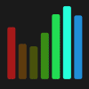

# WLED Efectos

[Paletas](palettes.es.md) · **Efectos** · [Controles](controls.es.md)

Otros idiomas: [EN](effects.en.md) · [FR](effects.fr.md) · [DE](effects.de.md) · [IT](effects.it.md) · [JA](effects.ja.md) · [KO](effects.ko.md) · [ZH](effects.zh.md)

| Imagen | Nombre WLED | Traducción | Descripción |
|---|---|---|---|
|  | `Solid` | Fijo | Un color fijo y uniforme. |
|  | `Blink` | Parpadeo | Destellos nítidos, encendido/apagado. |
|  | `Breathe` | Respiración | El brillo crece y decae (respiración). |
|  | `Wipe` | Barrido | Un punto de luz recorre la tira (persecución). |
|  | `Wipe Random` | Wipe Random | Un punto de luz recorre la tira (persecución). |
|  | `Random Colors` | Random Colors | Una onda de color recorre la tira. |
|  | `Sweep` | Sweep | Un punto de luz recorre la tira (persecución). |
|  | `Dynamic` | Dynamic | Una onda de color recorre la tira. |
|  | `Colorloop` | Colorloop | El espectro completo se desplaza. |
|  | `Rainbow` | Arcoíris | El espectro completo se desplaza. |
|  | `Scan` | Scan | Un punto de luz recorre la tira (persecución). |
|  | `Scan Dual` | Scan Dual | Un punto de luz recorre la tira (persecución). |
|  | `Fade` | Desvanecer | El brillo crece y decae (respiración). |
|  | `Theater` | Theater | Un punto de luz recorre la tira (persecución). |
|  | `Theater Rainbow` | Theater Rainbow | El espectro completo se desplaza. |
|  | `Running` | Running | Un punto de luz recorre la tira (persecución). |
|  | `Saw` | Saw | Una onda de color recorre la tira. |
|  | `Twinkle` | Centelleo | Puntos que centellean al azar. |
|  | `Dissolve` | Dissolve | Puntos que centellean al azar. |
|  | `Dissolve Rnd` | Dissolve Rnd | Puntos que centellean al azar. |
|  | `Sparkle` | Destellos | Puntos que centellean al azar. |
|  | `Sparkle Dark` | Sparkle Dark | Puntos que centellean al azar. |
|  | `Sparkle+` | Sparkle+ | Puntos que centellean al azar. |
|  | `Strobe` | Estroboscopio | Destellos nítidos, encendido/apagado. |
|  | `Strobe Rainbow` | Strobe Rainbow | Destellos nítidos, encendido/apagado. |
|  | `Strobe Mega` | Strobe Mega | Destellos nítidos, encendido/apagado. |
|  | `Blink Rainbow` | Blink Rainbow | Destellos nítidos, encendido/apagado. |
|  | `Android` | Android | Una onda de color recorre la tira. |
|  | `Chase` | Persecución | Un punto de luz recorre la tira (persecución). |
|  | `Chase Random` | Chase Random | Un punto de luz recorre la tira (persecución). |
|  | `Chase Rainbow` | Chase Rainbow | El espectro completo se desplaza. |
|  | `Chase Flash` | Chase Flash | Un punto de luz recorre la tira (persecución). |
|  | `Chase Flash Rnd` | Chase Flash Rnd | Un punto de luz recorre la tira (persecución). |
|  | `Rainbow Runner` | Rainbow Runner | El espectro completo se desplaza. |
|  | `Colorful` | Colorful | El espectro completo se desplaza. |
|  | `Traffic Light` | Traffic Light | Una onda de color recorre la tira. |
|  | `Sweep Random` | Sweep Random | Un punto de luz recorre la tira (persecución). |
|  | `Chase 2` | Chase 2 | Un punto de luz recorre la tira (persecución). |
|  | `Aurora` | Aurora | El espectro completo se desplaza. |
|  | `Stream` | Stream | Una onda de color recorre la tira. |
|  | `Scanner` | Scanner | Un punto de luz recorre la tira (persecución). |
|  | `Lighthouse` | Lighthouse | Un punto de luz recorre la tira (persecución). |
|  | `Fireworks` | Fuegos artificiales | Puntos que centellean al azar. |
|  | `Rain` | Lluvia | Puntos que caen como lluvia. |
|  | `Tetrix` | Tetrix | Puntos que caen como lluvia. |
|  | `Fire Flicker` | Fuego parpadeante | Tonos cálidos titilan como llamas. |
|  | `Gradient` | Degradado | El brillo crece y decae (respiración). |
|  | `Loading` | Loading | Un punto de luz recorre la tira (persecución). |
|  | `Rolling Balls` | Rolling Balls | Una onda de color recorre la tira. |
|  | `Fairy` | Fairy | Puntos que centellean al azar. |
|  | `Two Dots` | Two Dots | Una onda de color recorre la tira. |
|  | `Fairytwinkle` | Fairytwinkle | Puntos que centellean al azar. |
|  | `Running Dual` | Running Dual | Un punto de luz recorre la tira (persecución). |
|  | `Image` | Image | Una onda de color recorre la tira. |
|  | `Chase 3` | Chase 3 | Un punto de luz recorre la tira (persecución). |
|  | `Tri Wipe` | Tri Wipe | Un punto de luz recorre la tira (persecución). |
|  | `Tri Fade` | Tri Fade | El brillo crece y decae (respiración). |
|  | `Lightning` | Relámpago | Destellos nítidos, encendido/apagado. |
|  | `ICU` | ICU | Una onda de color recorre la tira. |
|  | `Multi Comet` | Multi Comet | Un punto de luz recorre la tira (persecución). |
|  | `Scanner Dual` | Scanner Dual | Un punto de luz recorre la tira (persecución). |
|  | `Stream 2` | Stream 2 | Una onda de color recorre la tira. |
|  | `Oscillate` | Oscillate | Una onda de color recorre la tira. |
|  | `Pride 2015` | Pride 2015 | El espectro completo se desplaza. |
|  | `Juggle` | Juggle | Una onda de color recorre la tira. |
|  | `Palette` | Palette | El espectro completo se desplaza. |
|  | `Fire 2012` | Fire 2012 | Tonos cálidos titilan como llamas. |
|  | `Colorwaves` | Colorwaves | Una onda de color recorre la tira. |
|  | `Bpm` | Bpm | Una onda de color recorre la tira. |
|  | `Fill Noise` | Fill Noise | Un color fijo y uniforme. |
|  | `Noise 1` | Noise 1 | Una onda de color recorre la tira. |
|  | `Noise 2` | Noise 2 | Una onda de color recorre la tira. |
|  | `Noise 3` | Noise 3 | Una onda de color recorre la tira. |
|  | `Noise 4` | Noise 4 | Una onda de color recorre la tira. |
|  | `Colortwinkles` | Colortwinkles | Puntos que centellean al azar. |
|  | `Lake` | Lago | Una onda de color recorre la tira. |
|  | `Meteor` | Meteoro | Puntos que caen como lluvia. |
|  | `Copy Segment` | Copy Segment | Una onda de color recorre la tira. |
|  | `Railway` | Railway | Un punto de luz recorre la tira (persecución). |
|  | `Ripple` | Ripple | Una onda de color recorre la tira. |
|  | `Twinklefox` | Twinklefox | Puntos que centellean al azar. |
|  | `Twinklecat` | Twinklecat | Puntos que centellean al azar. |
|  | `Halloween Eyes` | Halloween Eyes | Tonos cálidos titilan como llamas. |
|  | `Solid Pattern` | Solid Pattern | Un color fijo y uniforme. |
|  | `Solid Pattern Tri` | Solid Pattern Tri | Un color fijo y uniforme. |
|  | `Spots` | Spots | Una onda de color recorre la tira. |
|  | `Spots Fade` | Spots Fade | El brillo crece y decae (respiración). |
|  | `Glitter` | Purpurina | Puntos que centellean al azar. |
|  | `Candle` | Vela | Tonos cálidos titilan como llamas. |
|  | `Fireworks Starburst` | Fireworks Starburst | Puntos que centellean al azar. |
|  | `Fireworks 1D` | Fireworks 1D | Puntos que centellean al azar. |
|  | `Bouncing Balls` | Bouncing Balls | Una onda de color recorre la tira. |
|  | `Sinelon` | Sinelon | El brillo crece y decae (respiración). |
|  | `Sinelon Dual` | Sinelon Dual | El brillo crece y decae (respiración). |
|  | `Sinelon Rainbow` | Sinelon Rainbow | El espectro completo se desplaza. |
|  | `Popcorn` | Popcorn | Puntos que centellean al azar. |
|  | `Drip` | Drip | Puntos que caen como lluvia. |
|  | `Plasma` | Plasma | Una onda de color recorre la tira. |
|  | `Percent` | Percent | Una onda de color recorre la tira. |
|  | `Ripple Rainbow` | Ripple Rainbow | El espectro completo se desplaza. |
|  | `Heartbeat` | Latido | Una onda de color recorre la tira. |
|  | `Pacifica` | Pacifica | Una onda de color recorre la tira. |
|  | `Candle Multi` | Candle Multi | Tonos cálidos titilan como llamas. |
|  | `Solid Glitter` | Solid Glitter | Un color fijo y uniforme. |
|  | `Sunrise` | Amanecer | Tonos cálidos titilan como llamas. |
|  | `Phased` | Phased | Una onda de color recorre la tira. |
|  | `Twinkleup` | Twinkleup | Puntos que centellean al azar. |
|  | `Noise Pal` | Noise Pal | Una onda de color recorre la tira. |
|  | `Sine` | Sine | El brillo crece y decae (respiración). |
|  | `Phased Noise` | Phased Noise | Una onda de color recorre la tira. |
|  | `Flow` | Flow | Una onda de color recorre la tira. |
|  | `Chunchun` | Chunchun | Una onda de color recorre la tira. |
|  | `Dancing Shadows` | Dancing Shadows | Un punto de luz recorre la tira (persecución). |
|  | `Washing Machine` | Washing Machine | Una onda de color recorre la tira. |
|  | `Rotozoomer` | Rotozoomer | Una onda de color recorre la tira. |
|  | `Blends` | Blends | El brillo crece y decae (respiración). |
|  | `TV Simulator` | TV Simulator | Una onda de color recorre la tira. |
|  | `Dynamic Smooth` | Dynamic Smooth | Una onda de color recorre la tira. |
|  | `Spaceships` | Spaceships | Una onda de color recorre la tira. |
|  | `Crazy Bees` | Crazy Bees | Una onda de color recorre la tira. |
|  | `Ghost Rider` | Ghost Rider | Una onda de color recorre la tira. |
|  | `Blobs` | Blobs | Una onda de color recorre la tira. |
|  | `Scrolling Text` | Scrolling Text | Una onda de color recorre la tira. |
|  | `Drift Rose` | Drift Rose | Una onda de color recorre la tira. |
|  | `Distortion Waves` | Distortion Waves | Una onda de color recorre la tira. |
|  | `Soap` | Soap | Una onda de color recorre la tira. |
|  | `Octopus` | Octopus | Una onda de color recorre la tira. |
|  | `Waving Cell` | Waving Cell | Una onda de color recorre la tira. |
|  | `Pixels` | Pixels | Una onda de color recorre la tira. |
|  | `Pixelwave` | Pixelwave | Una onda de color recorre la tira. |
|  | `Juggles` | Juggles | Una onda de color recorre la tira. |
|  | `Matripix` | Matripix | Una onda de color recorre la tira. |
|  | `Gravimeter` | Gravimeter | Una onda de color recorre la tira. |
|  | `Plasmoid` | Plasmoid | Una onda de color recorre la tira. |
|  | `Puddles` | Puddles | Una onda de color recorre la tira. |
|  | `Midnoise` | Midnoise | Una onda de color recorre la tira. |
|  | `Noisemeter` | Noisemeter | Una onda de color recorre la tira. |
|  | `Freqwave` | Freqwave | Una onda de color recorre la tira. |
|  | `Freqmatrix` | Freqmatrix | Puntos que caen como lluvia. |
|  | `GEQ` | GEQ | Una onda de color recorre la tira. |
|  | `Waterfall` | Cascada | Puntos que caen como lluvia. |
|  | `Freqpixels` | Freqpixels | Una onda de color recorre la tira. |
|  | `RSVD` | RSVD | Una onda de color recorre la tira. |
|  | `Noisefire` | Noisefire | Tonos cálidos titilan como llamas. |
|  | `Puddlepeak` | Puddlepeak | Una onda de color recorre la tira. |
|  | `Noisemove` | Noisemove | Una onda de color recorre la tira. |
|  | `Noise2D` | Noise2D | Una onda de color recorre la tira. |
|  | `Perlin Move` | Perlin Move | Una onda de color recorre la tira. |
|  | `Ripple Peak` | Ripple Peak | Una onda de color recorre la tira. |
|  | `Firenoise` | Firenoise | Tonos cálidos titilan como llamas. |
|  | `Squared Swirl` | Squared Swirl | Una onda de color recorre la tira. |
|  | `PacMan` | PacMan | Una onda de color recorre la tira. |
|  | `DNA` | DNA | Una onda de color recorre la tira. |
|  | `Matrix` | Matriz | Puntos que caen como lluvia. |
|  | `Metaballs` | Metaballs | Una onda de color recorre la tira. |
|  | `Freqmap` | Freqmap | Una onda de color recorre la tira. |
|  | `Gravcenter` | Gravcenter | Una onda de color recorre la tira. |
|  | `Gravcentric` | Gravcentric | Una onda de color recorre la tira. |
|  | `Gravfreq` | Gravfreq | Una onda de color recorre la tira. |
|  | `DJ Light` | DJ Light | Una onda de color recorre la tira. |
|  | `Funky Plank` | Funky Plank | Una onda de color recorre la tira. |
|  | `Shimmer` | Shimmer | Una onda de color recorre la tira. |
|  | `Pulser` | Pulser | El brillo crece y decae (respiración). |
|  | `Blurz` | Blurz | Una onda de color recorre la tira. |
|  | `Drift` | Drift | Una onda de color recorre la tira. |
|  | `Waverly` | Waverly | Una onda de color recorre la tira. |
|  | `Sun Radiation` | Sun Radiation | Una onda de color recorre la tira. |
|  | `Colored Bursts` | Colored Bursts | Una onda de color recorre la tira. |
|  | `Julia` | Julia | Una onda de color recorre la tira. |
|  | `RSVD` | RSVD | Una onda de color recorre la tira. |
|  | `RSVD` | RSVD | Una onda de color recorre la tira. |
|  | `RSVD` | RSVD | Una onda de color recorre la tira. |
|  | `Game Of Life` | Game Of Life | Una onda de color recorre la tira. |
|  | `Tartan` | Tartan | Una onda de color recorre la tira. |
|  | `Polar Lights` | Polar Lights | Una onda de color recorre la tira. |
|  | `Swirl` | Swirl | Una onda de color recorre la tira. |
|  | `Lissajous` | Lissajous | Una onda de color recorre la tira. |
|  | `Frizzles` | Frizzles | Una onda de color recorre la tira. |
|  | `Plasma Ball` | Plasma Ball | Una onda de color recorre la tira. |
|  | `Flow Stripe` | Flow Stripe | Una onda de color recorre la tira. |
|  | `Hiphotic` | Hiphotic | Una onda de color recorre la tira. |
|  | `Sindots` | Sindots | Una onda de color recorre la tira. |
|  | `DNA Spiral` | DNA Spiral | Una onda de color recorre la tira. |
|  | `Black Hole` | Black Hole | Una onda de color recorre la tira. |
|  | `Wavesins` | Wavesins | Una onda de color recorre la tira. |
|  | `Rocktaves` | Rocktaves | Una onda de color recorre la tira. |
|  | `Akemi` | Akemi | Una onda de color recorre la tira. |
|  | `PS Volcano` | PS Volcano | Una onda de color recorre la tira. |
|  | `PS Fire` | PS Fire | Tonos cálidos titilan como llamas. |
|  | `PS Fireworks` | PS Fireworks | Puntos que centellean al azar. |
|  | `PS Vortex` | PS Vortex | Una onda de color recorre la tira. |
|  | `PS Fuzzy Noise` | PS Fuzzy Noise | Una onda de color recorre la tira. |
|  | `PS Ballpit` | PS Ballpit | Una onda de color recorre la tira. |
|  | `PS Box` | PS Box | Una onda de color recorre la tira. |
|  | `PS Attractor` | PS Attractor | Una onda de color recorre la tira. |
|  | `PS Impact` | PS Impact | Una onda de color recorre la tira. |
|  | `PS Waterfall` | PS Waterfall | Puntos que caen como lluvia. |
|  | `PS Spray` | PS Spray | Una onda de color recorre la tira. |
|  | `PS GEQ 2D` | PS GEQ 2D | Una onda de color recorre la tira. |
|  | `PS GEQ Nova` | PS GEQ Nova | Una onda de color recorre la tira. |
|  | `PS Ghost Rider` | PS Ghost Rider | Una onda de color recorre la tira. |
|  | `PS Blobs` | PS Blobs | Una onda de color recorre la tira. |
|  | `PS DripDrop` | PS DripDrop | Puntos que caen como lluvia. |
|  | `PS Pinball` | PS Pinball | Una onda de color recorre la tira. |
|  | `PS Dancing Shadows` | PS Dancing Shadows | Un punto de luz recorre la tira (persecución). |
|  | `PS Fireworks 1D` | PS Fireworks 1D | Puntos que centellean al azar. |
|  | `PS Sparkler` | PS Sparkler | Puntos que centellean al azar. |
|  | `PS Hourglass` | PS Hourglass | Una onda de color recorre la tira. |
|  | `PS Spray 1D` | PS Spray 1D | Una onda de color recorre la tira. |
|  | `PS 1D Balance` | PS 1D Balance | Una onda de color recorre la tira. |
|  | `PS Chase` | PS Chase | Un punto de luz recorre la tira (persecución). |
|  | `PS Starburst` | PS Starburst | Puntos que centellean al azar. |
|  | `PS GEQ 1D` | PS GEQ 1D | Una onda de color recorre la tira. |
|  | `PS Fire 1D` | PS Fire 1D | Tonos cálidos titilan como llamas. |
|  | `PS Sonic Stream` | PS Sonic Stream | Una onda de color recorre la tira. |
|  | `PS Sonic Boom` | PS Sonic Boom | Una onda de color recorre la tira. |
|  | `PS Springy` | PS Springy | Una onda de color recorre la tira. |
|  | `PS Galaxy` | PS Galaxy | Una onda de color recorre la tira. |
|  | `Color Clouds` | Color Clouds | Una onda de color recorre la tira. |
|  | `Slow Transition` | Slow Transition | Una onda de color recorre la tira. |
