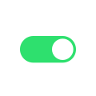
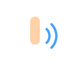

# WLED Buttons

[Palettes](palettes.md) · [Effects](effects.md) · [Controls](controls.md) · [Nightlight](nightlight.md) · [Segment](segment.md) · **Buttons** · [Effect sliders](fxdata.md) · [Info fields](info.md) · [UI labels](ui.md) &nbsp;•&nbsp; [Reference in English](README.md)

Other languages: [FR](../fr/buttons.md) · [DE](../de/buttons.md) · [ES](../es/buttons.md) · [IT](../it/buttons.md) · [JA](../ja/buttons.md) · [KO](../ko/buttons.md) · [ZH](../zh/buttons.md)

**Button types** are set in **Settings → LED & Hardware**: how a physical button/input wired to the controller behaves (push, switch, PIR, touch, analog…). Config only — no effect on the light output.

| Image | WLED name | Translation | Description |
|---|---|---|---|
|  | `Push` | Push | How the physical button/input is wired. |
|  | `Push inverted` | Push inverted | How the physical button/input is wired. |
|  | `Switch` | Switch | How the physical button/input is wired. |
|  | `PIR sensor` | PIR sensor | How the physical button/input is wired. |
|  | `Touch` | Touch | How the physical button/input is wired. |
|  | `Analog` | Analog | How the physical button/input is wired. |
