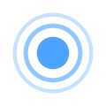

# WLED Eventos de botón

[Paletas](palettes.md) · [Efectos](effects.md) · [Controles](controls.md) · [Luz nocturna](nightlight.md) · [Segmento](segment.md) · [Botones](buttons.md) · **Eventos de botón** · [Presets](presets.md) · [Deslizadores](fxdata.md) · [Campos de info](info.md) · [Etiquetas de IU](ui.md) &nbsp;•&nbsp; [Referencia en español](README.md)

Otros idiomas: [EN](../en/button-events.md) · [FR](../fr/button-events.md) · [DE](../de/button-events.md) · [IT](../it/button-events.md) · [JA](../ja/button-events.md) · [KO](../ko/button-events.md) · [ZH](../zh/button-events.md)

Los **eventos de botón** son *cuándo* dispara un botón físico — pulsación corta, larga o doble. WLED asigna a cada evento un **preset o acción** (`btn[].macros`), en **Ajustes → LED y hardware**.

| Imagen | Nombre WLED | Traducción | Descripción |
|---|---|---|---|
|  | `Short press` | Pulsación corta | Pulsar y soltar rápido — dispara la acción de pulsación corta (`btn[].macros[0]`). |
|  | `Long press` | Pulsación larga | Botón mantenido — acción de pulsación larga (`btn[].macros[1]`); por defecto cambia el brillo. |
|  | `Double press` | Doble pulsación | Dos pulsaciones rápidas — acción de doble pulsación (`btn[].macros[2]`). |
