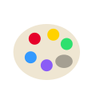
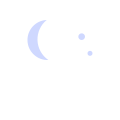
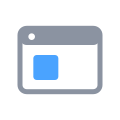

# WLED 🇫🇷 — Français

-  [Palettes](palettes.md)
-  [Effets](effects.md)
-  [Contrôles](controls.md)
-  [Veilleuse](nightlight.md)
-  [Segment](segment.md)
-  [Boutons](buttons.md)
-  [Événements bouton](button-events.md)
-  [Préréglages](presets.md)
-  [Curseurs d'effet](fxdata.md)
-  [Champs Info](info.md)
-  [Libellés d'UI](ui.md)

---

**Autres langues:** [🇬🇧 English](../en/README.md) · [🇩🇪 Deutsch](../de/README.md) · [🇪🇸 Español](../es/README.md) · [🇮🇹 Italiano](../it/README.md) · [🇯🇵 日本語](../ja/README.md) · [🇰🇷 한국어](../ko/README.md) · [🇨🇳 中文](../zh/README.md)

[↑ toutes les langues](../README.md)
