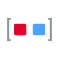

# WLED Préréglages

[Palettes](palettes.md) · [Effets](effects.md) · [Contrôles](controls.md) · [Veilleuse](nightlight.md) · [Segment](segment.md) · [Boutons](buttons.md) · [Événements bouton](button-events.md) · **Préréglages** · [Curseurs d'effet](fxdata.md) · [Champs Info](info.md) · [Libellés d'UI](ui.md) &nbsp;•&nbsp; [Référence en français](README.md)

Autres langues: [EN](../en/presets.md) · [DE](../de/presets.md) · [ES](../es/presets.md) · [IT](../it/presets.md) · [JA](../ja/presets.md) · [KO](../ko/presets.md) · [ZH](../zh/presets.md)

Les **presets** enregistrent tout un rendu (ou une playlist de rendus) à rappeler en un geste — depuis l'onglet **Préréglages**, un bouton physique, un minuteur ou l'API (`ps`/`/presets.json`). Voici les *libellés d'options* de création ; les **noms** des presets, eux, sont les tiens.

| Image | Nom WLED | Traduction | Description |
|---|---|---|---|
|  | `Save preset` | Enregistrer le preset | Store the current look as a numbered preset. |
|  | `Preset name` | Nom du preset | The label a preset appears under. |
|  | `Quick load label` | Étiquette d'accès rapide | A 1-2 character tag (QLL) for the quick-select bar. |
|  | `Include brightness` | Inclure la luminosité | Whether recalling the preset also sets brightness. |
|  | `Save segment bounds` | Enregistrer les bornes de segment | Store each segment's start/stop, not just its style. |
|  | `Use current state` | Utiliser l'état actuel | Snapshot the live light state into the preset. |
|  | `API command` | Commande API | Store a raw HTTP/JSON API call instead of a state snapshot. |
|  | `Playlist` | Playlist | A preset that cycles through other presets. |
|  | `Duration` | Durée | How long each playlist entry plays. |
|  | `Transition` | Transition | Crossfade time between playlist entries. |
|  | `Repeat` | Répéter | How many times the playlist loops (0 = forever). |
|  | `Shuffle` | Aléatoire | Play the playlist entries in random order. |
|  | `End preset` | Preset de fin | The preset to apply when the playlist finishes. |
