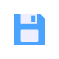
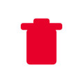
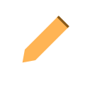
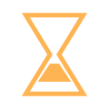

# WLED Libellés d'UI

[Palettes](palettes.md) · [Effets](effects.md) · [Contrôles](controls.md) · [Veilleuse](nightlight.md) · [Segment](segment.md) · [Boutons](buttons.md) · [Événements bouton](button-events.md) · [Préréglages](presets.md) · [Curseurs d'effet](fxdata.md) · [Champs Info](info.md) · **Libellés d'UI** &nbsp;•&nbsp; [Référence en français](README.md)

Autres langues: [EN](../en/ui.md) · [DE](../de/ui.md) · [ES](../es/ui.md) · [IT](../it/ui.md) · [JA](../ja/ui.md) · [KO](../ko/ui.md) · [ZH](../zh/ui.md)

Les **libellés d'UI** sont l'habillage de l'app web / mobile WLED elle-même — noms d'onglets, boutons et actions (Couleurs, Effets, Segments, Préréglages, Réglages, Enregistrer, Sync, En direct…).

| Image | Nom WLED | Traduction | Description |
|---|---|---|---|
|  | `Colors` | Couleurs |  |
|  | `Effects` | Effets |  |
|  | `Segments` | Segments |  |
|  | `Presets` | Préréglages |  |
|  | `Settings` | Réglages |  |
|  | `Info` | Infos |  |
|  | `Brightness` | Luminosité |  |
|  | `Save` | Enregistrer |  |
|  | `Delete` | Supprimer |  |
|  | `Rename` | Renommer |  |
|  | `Add segment` | Ajouter un segment |  |
|  | `Duplicate` | Dupliquer |  |
|  | `Reset` | Réinitialiser |  |
|  | `Apply` | Appliquer |  |
|  | `Timer` | Minuteur |  |
|  | `Sync` | Synchronisation |  |
|  | `Live` | En direct |  |
|  | `Peek` | Aperçu |  |
|  | `Reboot` | Redémarrer |  |
|  | `Discover devices` | Découvrir les appareils |  |
