# WLED エフェクト

[パレット](palettes.md) · **エフェクト** · [コントロール](controls.md) · [ナイトライト](nightlight.md) · [セグメント](segment.md) · [ボタン](buttons.md) · [ボタンイベント](button-events.md) · [プリセット](presets.md) · [スライダー](fxdata.md) · [情報項目](info.md) · [UIラベル](ui.md) &nbsp;•&nbsp; [日本語リファレンス](README.md)

他の言語: [EN](../en/effects.md) · [FR](../fr/effects.md) · [DE](../de/effects.md) · [ES](../es/effects.md) · [IT](../it/effects.md) · [KO](../ko/effects.md) · [ZH](../zh/effects.md)

**エフェクト**はWLEDのアニメーション模様。**エフェクト**タブで選択（`seg.fx`、一覧`/json/eff`）。効果が*動き*、パレットが*色*。

| 画像 | WLED名 | 翻訳 | 説明 |
|---|---|---|---|
| 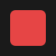 | `Solid` | Solid | 単一の安定した色。 |
|  | `Blink` | Blink | はっきりした点滅——目のように。 |
|  | `Breathe` | Breathe | 明るさが膨らんでは沈む。 |
| 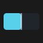 | `Wipe` | Wipe | ワイパーが払う。 |
|  | `Wipe Random` | Wipe Random | ワイパーが払う。 |
| 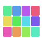 | `Random Colors` | Random Colors | 全体がランダムな一色に変わる。 |
| 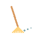 | `Sweep` | Sweep | ワイパーのように光が振れる。 |
| 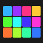 | `Dynamic` | Dynamic | 色ブロックがランダムに変わる。 |
| 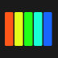 | `Colorloop` | Colorloop | 全体が色相を巡る。 |
|  | `Rainbow` | Rainbow | 虹の弧が巡る。 |
| 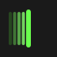 | `Scan` | Scan | スキャナーが左右に走る。 |
| 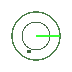 | `Scan Dual` | Scan Dual | スキャナーが左右に走る。 |
| 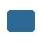 | `Fade` | Fade | 色が現れては消える。 |
| 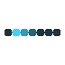 | `Theater` | Theater | 光点が尾を引いて走る。 |
| 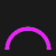 | `Theater Rainbow` | Theater Rainbow | 虹の弧が巡る。 |
| 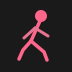 | `Running` | Running | 人影が走る。 |
| 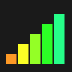 | `Saw` | Saw | のこぎりが行き来する。 |
| 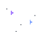 | `Twinkle` | Twinkle | 星がまたたく。 |
| 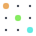 | `Dissolve` | Dissolve | ランダムにきらめく。 |
| 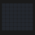 | `Dissolve Rnd` | Dissolve Rnd | ランダムにきらめく。 |
| 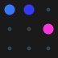 | `Sparkle` | Sparkle | ランダムにきらめく。 |
| 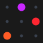 | `Sparkle Dark` | Sparkle Dark | ランダムにきらめく。 |
|  | `Sparkle+` | Sparkle+ | ランダムにきらめく。 |
|  | `Strobe` | Strobe | 強いストロボ点滅。 |
|  | `Strobe Rainbow` | Strobe Rainbow | 虹の弧が巡る。 |
|  | `Strobe Mega` | Strobe Mega | 強いストロボ点滅。 |
|  | `Blink Rainbow` | Blink Rainbow | 虹の弧が巡る。 |
| 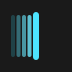 | `Android` | Android | スキャナーが左右に走る。 |
| 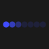 | `Chase` | Chase | 光点が尾を引いて走る。 |
| 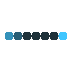 | `Chase Random` | Chase Random | 光点が尾を引いて走る。 |
| 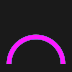 | `Chase Rainbow` | Chase Rainbow | 虹の弧が巡る。 |
| 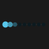 | `Chase Flash` | Chase Flash | 光点が尾を引いて走る。 |
| 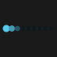 | `Chase Flash Rnd` | Chase Flash Rnd | 光点が尾を引いて走る。 |
| 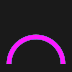 | `Rainbow Runner` | Rainbow Runner | 虹の弧が巡る。 |
| 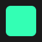 | `Colorful` | Colorful | 多彩な色の帯。 |
|  | `Traffic Light` | Traffic Light | 信号機が変わる。 |
| 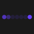 | `Sweep Random` | Sweep Random | ワイパーのように光が振れる。 |
| 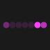 | `Chase 2` | Chase 2 | 光点が尾を引いて走る。 |
|  | `Aurora` | Aurora | オーロラの帯が揺らめく。 |
| 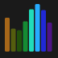 | `Stream` | Stream | 粒子が流れていく。 |
|  | `Scanner` | Scanner | スキャナーが左右に走る。 |
|  | `Lighthouse` | Lighthouse | 灯台のように光線が回る。 |
| 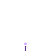 | `Fireworks` | Fireworks | 花火が打ち上がる。 |
| 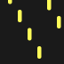 | `Rain` | Rain | 雨が降る。 |
| 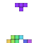 | `Tetrix` | Tetrix | テトリスのブロックが落ちて積まれる。 |
| 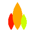 | `Fire Flicker` | Fire Flicker | 炎が揺らめき立ち上る。 |
|  | `Gradient` | Gradient | 移り変わるグラデーション。 |
|  | `Loading` | Loading | 進捗バーが満ちる。 |
| 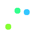 | `Rolling Balls` | Rolling Balls | ボールが跳ね回る。 |
| 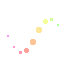 | `Fairy` | Fairy | 妖精の光がきらめく。 |
| 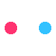 | `Two Dots` | Two Dots | 2つの点が互いを巡る。 |
| 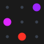 | `Fairytwinkle` | Fairytwinkle | 妖精の光がきらめく。 |
| 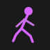 | `Running Dual` | Running Dual | 人影が走る。 |
| 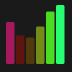 | `Image` | Image | 画像が再生される。 |
| 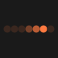 | `Chase 3` | Chase 3 | 光点が尾を引いて走る。 |
| 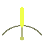 | `Tri Wipe` | Tri Wipe | ワイパーが払う。 |
| 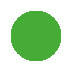 | `Tri Fade` | Tri Fade | 色が現れては消える。 |
| 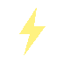 | `Lightning` | Lightning | 稲妻が走る。 |
|  | `ICU` | ICU | 瞳が動いて見渡す。 |
| 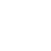 | `Multi Comet` | Multi Comet | 彗星が尾を引いて走る。 |
| 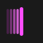 | `Scanner Dual` | Scanner Dual | スキャナーが左右に走る。 |
| 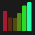 | `Stream 2` | Stream 2 | 粒子が流れていく。 |
| 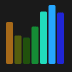 | `Oscillate` | Oscillate | 色の波がストリップを進む。 |
| 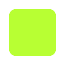 | `Pride 2015` | Pride 2015 | 全体が色相を巡る。 |
| 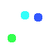 | `Juggle` | Juggle | ボールが跳ね回る。 |
|  | `Palette` | Palette | 全体が色相を巡る。 |
|  | `Fire 2012` | Fire 2012 | 炎が揺らめき立ち上る。 |
|  | `Colorwaves` | Colorwaves | 多彩な色の帯。 |
| 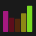 | `Bpm` | Bpm | 拍ごとに脈打つ。 |
|  | `Fill Noise` | Fill Noise | 単一の安定した色。 |
|  | `Noise 1` | Noise 1 | ランダムにきらめく。 |
|  | `Noise 2` | Noise 2 | ランダムにきらめく。 |
|  | `Noise 3` | Noise 3 | ランダムにきらめく。 |
|  | `Noise 4` | Noise 4 | ランダムにきらめく。 |
|  | `Colortwinkles` | Colortwinkles | 星がまたたく。 |
|  | `Lake` | Lake | 水面に波紋が広がる。 |
|  | `Meteor` | Meteor | 彗星が尾を引いて走る。 |
|  | `Copy Segment` | Copy Segment | 色の波がストリップを進む。 |
|  | `Railway` | Railway | 光点が尾を引いて走る。 |
|  | `Ripple` | Ripple | 水面に波紋が広がる。 |
|  | `Twinklefox` | Twinklefox | 星がまたたく。 |
|  | `Twinklecat` | Twinklecat | 星がまたたく。 |
|  | `Halloween Eyes` | Halloween Eyes | 暗闇で一対の目がまばたく。 |
|  | `Solid Pattern` | Solid Pattern | 単一の安定した色。 |
|  | `Solid Pattern Tri` | Solid Pattern Tri | 単一の安定した色。 |
|  | `Spots` | Spots | 斑点が現れては消える。 |
|  | `Spots Fade` | Spots Fade | 斑点が現れては消える。 |
|  | `Glitter` | Glitter | 色の上にグリッターが輝く。 |
|  | `Candle` | Candle | ろうそくの炎が揺らめく。 |
|  | `Fireworks Starburst` | Fireworks Starburst | 花火が打ち上がる。 |
|  | `Fireworks 1D` | Fireworks 1D | 花火が打ち上がる。 |
|  | `Bouncing Balls` | Bouncing Balls | ボールが跳ね回る。 |
|  | `Sinelon` | Sinelon | 彗星が尾を引いて走る。 |
|  | `Sinelon Dual` | Sinelon Dual | 彗星が尾を引いて走る。 |
|  | `Sinelon Rainbow` | Sinelon Rainbow | 彗星が尾を引いて走る。 |
|  | `Popcorn` | Popcorn | ポップコーンが弾ける。 |
|  | `Drip` | Drip | しずくが一つずつ落ちる。 |
|  | `Plasma` | Plasma | 色の塊が形を変える。 |
|  | `Percent` | Percent | バーが所定の量まで満ちる。 |
|  | `Ripple Rainbow` | Ripple Rainbow | 虹の弧が巡る。 |
|  | `Heartbeat` | Heartbeat | 心臓が鼓動する。 |
|  | `Pacifica` | Pacifica | 水面に波紋が広がる。 |
|  | `Candle Multi` | Candle Multi | ろうそくの炎が揺らめく。 |
|  | `Solid Glitter` | Solid Glitter | 色の上にグリッターが輝く。 |
|  | `Sunrise` | Sunrise | 太陽が昇る。 |
|  | `Phased` | Phased | 重なる正弦波がずれていく。 |
|  | `Twinkleup` | Twinkleup | 星がまたたく。 |
|  | `Noise Pal` | Noise Pal | ランダムにきらめく。 |
|  | `Sine` | Sine | 明るさが膨らんでは沈む。 |
|  | `Phased Noise` | Phased Noise | 重なる正弦波がずれていく。 |
|  | `Flow` | Flow | 粒子が流れていく。 |
|  | `Chunchun` | Chunchun | 鳥の群れが飛び去る。 |
|  | `Dancing Shadows` | Dancing Shadows | 人影が踊る。 |
|  | `Washing Machine` | Washing Machine | 車輪が回る。 |
|  | `Rotozoomer` | Rotozoomer | 車輪が回る。 |
|  | `Blends` | Blends | 移り変わるグラデーション。 |
|  | `TV Simulator` | TV Simulator | テレビの砂嵐がちらつく。 |
|  | `Dynamic Smooth` | Dynamic Smooth | 色ブロックがランダムに変わる。 |
|  | `Spaceships` | Spaceships | 宇宙船が滑るように進む。 |
|  | `Crazy Bees` | Crazy Bees | ミツバチが群れで飛び回る。 |
|  | `Ghost Rider` | Ghost Rider | 幽霊が漂う。 |
|  | `Blobs` | Blobs | 色の塊が形を変える。 |
|  | `Scrolling Text` | Scrolling Text | 文字のようにブロックが流れる。 |
|  | `Drift Rose` | Drift Rose | 渦が外へと巻いていく。 |
|  | `Distortion Waves` | Distortion Waves | 色の波がストリップを進む。 |
|  | `Soap` | Soap | シャボン玉が漂う。 |
|  | `Octopus` | Octopus | タコが触手を振る。 |
|  | `Waving Cell` | Waving Cell | 色の波がストリップを進む。 |
|  | `Pixels` | Pixels | マトリックス風にコードが降る。 |
|  | `Pixelwave` | Pixelwave | マトリックス風にコードが降る。 |
|  | `Juggles` | Juggles | ボールが跳ね回る。 |
|  | `Matripix` | Matripix | マトリックス風にコードが降る。 |
|  | `Gravimeter` | Gravimeter | ボールが跳ね回る。 |
|  | `Plasmoid` | Plasmoid | 色の塊が形を変える。 |
|  | `Puddles` | Puddles | 雨が降る。 |
|  | `Midnoise` | Midnoise | ランダムにきらめく。 |
|  | `Noisemeter` | Noisemeter | ランダムにきらめく。 |
|  | `Freqwave` | Freqwave | 水面に波紋が広がる。 |
|  | `Freqmatrix` | Freqmatrix | マトリックス風にコードが降る。 |
|  | `GEQ` | GEQ | 水面に波紋が広がる。 |
|  | `Waterfall` | Waterfall | 雨が降る。 |
|  | `Freqpixels` | Freqpixels | マトリックス風にコードが降る。 |
|  | `RSVD` | RSVD | 色の波がストリップを進む。 |
|  | `Noisefire` | Noisefire | 炎が揺らめき立ち上る。 |
|  | `Puddlepeak` | Puddlepeak | 雨が降る。 |
|  | `Noisemove` | Noisemove | ランダムにきらめく。 |
|  | `Noise2D` | Noise2D | ランダムにきらめく。 |
|  | `Perlin Move` | Perlin Move | 色の波がストリップを進む。 |
|  | `Ripple Peak` | Ripple Peak | 水面に波紋が広がる。 |
|  | `Firenoise` | Firenoise | 炎が揺らめき立ち上る。 |
|  | `Squared Swirl` | Squared Swirl | 渦が外へと巻いていく。 |
|  | `PacMan` | PacMan | パックマンが食べ進む。 |
|  | `DNA` | DNA | 2本の鎖が二重らせんになる。 |
|  | `Matrix` | Matrix | マトリックス風にコードが降る。 |
|  | `Metaballs` | Metaballs | ボールが跳ね回る。 |
|  | `Freqmap` | Freqmap | 水面に波紋が広がる。 |
|  | `Gravcenter` | Gravcenter | ボールが跳ね回る。 |
|  | `Gravcentric` | Gravcentric | ボールが跳ね回る。 |
|  | `Gravfreq` | Gravfreq | ボールが跳ね回る。 |
|  | `DJ Light` | DJ Light | ターンテーブルが回る。 |
|  | `Funky Plank` | Funky Plank | 色の波がストリップを進む。 |
|  | `Shimmer` | Shimmer | 色の波がストリップを進む。 |
|  | `Pulser` | Pulser | 明るさが膨らんでは沈む。 |
|  | `Blurz` | Blurz | 色の波がストリップを進む。 |
|  | `Drift` | Drift | 渦が外へと巻いていく。 |
|  | `Waverly` | Waverly | 色の波がストリップを進む。 |
|  | `Sun Radiation` | Sun Radiation | 太陽が回転する光線を放つ。 |
|  | `Colored Bursts` | Colored Bursts | 太陽が回転する光線を放つ。 |
|  | `Julia` | Julia | ジュリア集合のフラクタルが変形する。 |
|  | `RSVD` | RSVD | 色の波がストリップを進む。 |
|  | `RSVD` | RSVD | 色の波がストリップを進む。 |
|  | `RSVD` | RSVD | 色の波がストリップを進む。 |
|  | `Game Of Life` | Game Of Life | 格子上でセルが生と死を繰り返す。 |
|  | `Tartan` | Tartan | スコットランドのタータン。 |
|  | `Polar Lights` | Polar Lights | オーロラの帯が揺らめく。 |
|  | `Swirl` | Swirl | 渦が外へと巻いていく。 |
|  | `Lissajous` | Lissajous | リサージュ曲線が変形する。 |
|  | `Frizzles` | Frizzles | 回転する幾何学模様。 |
|  | `Plasma Ball` | Plasma Ball | ボールが跳ね回る。 |
|  | `Flow Stripe` | Flow Stripe | 粒子が流れていく。 |
|  | `Hiphotic` | Hiphotic | 色の波がストリップを進む。 |
|  | `Sindots` | Sindots | 渦が外へと巻いていく。 |
|  | `DNA Spiral` | DNA Spiral | 2本の鎖が二重らせんになる。 |
|  | `Black Hole` | Black Hole | 輪が暗い核へと崩れ落ちる。 |
|  | `Wavesins` | Wavesins | 色の波がストリップを進む。 |
|  | `Rocktaves` | Rocktaves | 音符が流れていく。 |
|  | `Akemi` | Akemi | WLEDのマスコット、Akemiが現れる。 |
|  | `PS Volcano` | PS Volcano | 炎が揺らめき立ち上る。 |
|  | `PS Fire` | PS Fire | 炎が揺らめき立ち上る。 |
|  | `PS Fireworks` | PS Fireworks | 花火が打ち上がる。 |
|  | `PS Vortex` | PS Vortex | 渦が外へと巻いていく。 |
|  | `PS Fuzzy Noise` | PS Fuzzy Noise | ランダムにきらめく。 |
|  | `PS Ballpit` | PS Ballpit | ボールが跳ね回る。 |
|  | `PS Box` | PS Box | 色の波がストリップを進む。 |
|  | `PS Attractor` | PS Attractor | 色の波がストリップを進む。 |
|  | `PS Impact` | PS Impact | 衝撃波の輪が広がる。 |
|  | `PS Waterfall` | PS Waterfall | 雨が降る。 |
|  | `PS Spray` | PS Spray | 色の波がストリップを進む。 |
|  | `PS GEQ 2D` | PS GEQ 2D | 水面に波紋が広がる。 |
|  | `PS GEQ Nova` | PS GEQ Nova | 水面に波紋が広がる。 |
|  | `PS Ghost Rider` | PS Ghost Rider | 幽霊が漂う。 |
|  | `PS Blobs` | PS Blobs | 色の塊が形を変える。 |
|  | `PS DripDrop` | PS DripDrop | しずくが一つずつ落ちる。 |
|  | `PS Pinball` | PS Pinball | ボールが跳ね回る。 |
|  | `PS Dancing Shadows` | PS Dancing Shadows | 人影が踊る。 |
|  | `PS Fireworks 1D` | PS Fireworks 1D | 花火が打ち上がる。 |
|  | `PS Sparkler` | PS Sparkler | ランダムにきらめく。 |
|  | `PS Hourglass` | PS Hourglass | 砂時計の砂が落ちる。 |
|  | `PS Spray 1D` | PS Spray 1D | 色の波がストリップを進む。 |
|  | `PS 1D Balance` | PS 1D Balance | 色の波がストリップを進む。 |
|  | `PS Chase` | PS Chase | 光点が尾を引いて走る。 |
|  | `PS Starburst` | PS Starburst | 星がまたたく。 |
|  | `PS GEQ 1D` | PS GEQ 1D | 水面に波紋が広がる。 |
|  | `PS Fire 1D` | PS Fire 1D | 炎が揺らめき立ち上る。 |
|  | `PS Sonic Stream` | PS Sonic Stream | 粒子が流れていく。 |
|  | `PS Sonic Boom` | PS Sonic Boom | 衝撃波の輪が広がる。 |
|  | `PS Springy` | PS Springy | 色の波がストリップを進む。 |
|  | `PS Galaxy` | PS Galaxy | 星が渦を巻く。 |
|  | `Color Clouds` | Color Clouds | 色の塊が形を変える。 |
|  | `Slow Transition` | Slow Transition | 色の波がストリップを進む。 |
