# WLED パレット

**パレット** · [エフェクト](effects.md) · [コントロール](controls.md) · [色](colors.md) · [ナイトライト](nightlight.md) · [セグメント](segment.md) · [ボタン](buttons.md) · [スライダー](fxdata.md) &nbsp;•&nbsp; [日本語リファレンス](README.md)

他の言語: [EN](../en/palettes.md) · [FR](../fr/palettes.md) · [DE](../de/palettes.md) · [ES](../es/palettes.md) · [IT](../it/palettes.md) · [KO](../ko/palettes.md) · [ZH](../zh/palettes.md)

| 画像 | WLED名 | 翻訳 | 説明 |
|---|---|---|---|
| 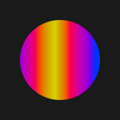 | `Default` | デフォルト | WLEDの既定の虹スペクトル。 |
|  | `Random Cycle` | * Random Cycle |  |
| 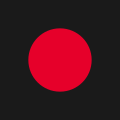 | `Color 1` | * Color 1 |  |
|  | `Colors 1&2` | * Colors 1&2 |  |
|  | `Color Gradient` | * Color Gradient |  |
|  | `Colors Only` | * Colors Only |  |
| 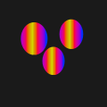 | `Party` | パーティー | お祝いの彩り——パーティーの風船。 |
|  | `Cloud` | 雲 | やわらかな空の青——雲。 |
| 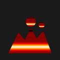 | `Lava` | 溶岩 | 溶けた岩——火山。 |
| 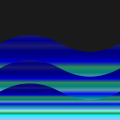 | `Ocean` | 海 | 海の青と緑——大洋の波。 |
| 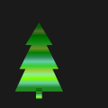 | `Forest` | 森 | 森の緑——木々。 |
|  | `Rainbow` | 虹 | 全スペクトル——虹の弧。 |
| 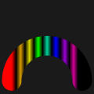 | `Rainbow Bands` | 虹のバンド | くっきりした帯の虹。 |
| 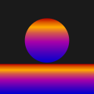 | `Sunset` | 夕焼け | 夕暮れの暖色——地平線の太陽。 |
|  | `Rivendell` | Rivendell | トールキン『指輪物語』のエルフの谷、裂け谷——霧深い山と森。 |
|  | `Breeze` | そよ風 | そよ風——風の筋。 |
| 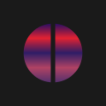 | `Red & Blue` | 赤 & 青 | 赤と青の二色。 |
|  | `Yellowout` | イエローアウト | 黄色がやわらかく抜けていく。 |
| 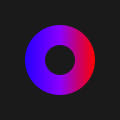 | `Analogous` | Analogous | 類似色——色相環の隣同士。 |
| 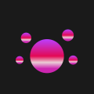 | `Splash` | スプラッシュ | 水滴のしぶき。 |
|  | `Pastel` | パステル | やわらかなパステル。 |
| 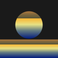 | `Sunset 2` | 夕焼け 2 | 別の夕焼けバリエーション。 |
| 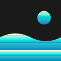 | `Beach` | ビーチ | 砂、海、太陽。 |
|  | `Vintage` | ヴィンテージ | 色あせたレトロ調——古いフィルム。 |
|  | `Departure` | 出発 | 旅・地平線のテーマ——コンパスの星。 |
| 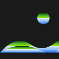 | `Landscape` | 風景 | 太陽の下の丘陵。 |
|  | `Beech` | Beech | ブナの木——森の緑。 |
| 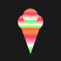 | `Sherbet` | シャーベット | パステルのシャーベット——アイスクリームコーン。 |
|  | `Hult` | Hult | 抽象的なパレット名(字義なし)。 |
| 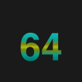 | `Hult 64` | Hult 64 | Hultパレット、64版。 |
|  | `Drywet` | Drywet | 乾から湿へのグラデーション——水滴。 |
| 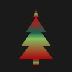 | `Jul` | Jul | 「Jul」——北欧のユール(クリスマス):飾られたツリー。 |
| 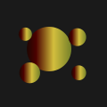 | `Grintage` | Grintage | 造語(グランジ+ヴィンテージ感)。 |
|  | `Rewhi` | 赤白 | 赤白の混合(短縮)。 |
|  | `Tertiary` | 三次色 | 色相環の三次色。 |
|  | `Fire` | 火 | 炎——黄から深紅へ。 |
|  | `Icefire` | 氷と炎 | 氷と炎——青から赤へ。 |
| 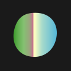 | `Cyane` | Cyane | シアン寄りの抽象パレット。 |
|  | `Light Pink` | ライトピンク | 淡いライトピンク。 |
| 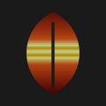 | `Autumn` | 秋 | 秋の紅葉——一枚の葉。 |
| 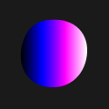 | `Magenta` | マゼンタ | マゼンタの階調。 |
| 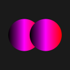 | `Magred` | マゼンタ赤 | マゼンタ赤の混合(短縮)。 |
| 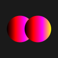 | `Yelmag` | 黄マゼンタ | 黄マゼンタの混合(短縮)。 |
|  | `Yelblu` | 黄青 | 黄青の混合(短縮)。 |
|  | `Orange & Teal` | オレンジ & ティール | 映画的なオレンジ×ティールの組合せ。 |
|  | `Tiamat` | Tiamat | バビロニアの原初の海竜の女神ティアマト——深海の鱗の蛇。 |
| 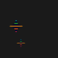 | `April Night` | 四月の夜 | 春の夜空——三日月と星。 |
|  | `Orangery` | Orangery | 柑橘——オレンジの輪切り。 |
| 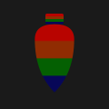 | `C9` | C9 | 定番の米国クリスマス電球C9形。 |
|  | `Sakura` | 桜 | 桜。 |
| 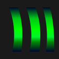 | `Aurora` | オーロラ | オーロラ——輝く空のカーテン。 |
| 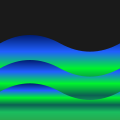 | `Atlantica` | Atlantica | 大西洋・大洋の深み——海の波。 |
| 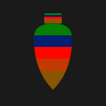 | `C9 2` | C9 2 | C9電球パレット、その2。 |
| 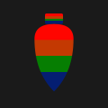 | `C9 New` | C9新 | C9電球パレットの新版。 |
| 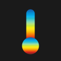 | `Temperature` | 温度 | 寒暖のスケール——温度計。 |
|  | `Aurora 2` | オーロラ 2 | オーロラ、その2。 |
|  | `Retro Clown` | レトロピエロ | レトロなサーカスの道化師。 |
|  | `Candy` | キャンディ | お菓子——渦巻きのペロペロキャンディ。 |
|  | `Toxy Reaf` | Toxy Reaf | 毒々しく鮮やかなサンゴ礁(WLEDは「reaf」と表記)。 |
|  | `Fairy Reaf` | 妖精の岩礁 | きらめく妖精のようなサンゴ礁。 |
| 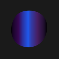 | `Semi Blue` | Semi Blue | 青主体のパレット。 |
|  | `Pink Candy` | ピンクキャンディ | ピンクのお菓子——ペロペロキャンディ。 |
|  | `Red Reaf` | 赤い岩礁 | 赤いサンゴ礁。 |
| 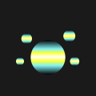 | `Aqua Flash` | アクアフラッシュ | 水しぶき——スプラッシュ。 |
|  | `Yelblu Hot` | 黄青ホット | より熱い黄青の混合。 |
|  | `Lite Light` | 淡い光 | やわらかく淡い光——電球。 |
|  | `Red Flash` | 赤フラッシュ | 赤い電光——稲妻。 |
|  | `Blink Red` | 赤点滅 | 点滅する赤——稲妻。 |
|  | `Red Shift` | 赤方偏移 | 「赤方偏移」——赤へずれる光;稲妻。 |
| 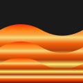 | `Red Tide` | 赤潮 | 「赤潮」——藻の大量発生で海が赤くなる;波。 |
|  | `Candy2` | キャンディ2 | お菓子その2——ペロペロキャンディ。 |
|  | `Traffic Light` | 信号機 | 信号機——赤・黄・緑。 |
