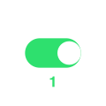
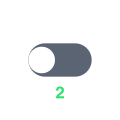
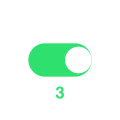
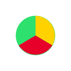

# WLED 컨트롤

[팔레트](palettes.md) · [효과](effects.md) · **컨트롤** · [야간등](nightlight.md) · [세그먼트](segment.md) · [버튼](buttons.md) · [슬라이더](fxdata.md) · [정보 항목](info.md) · [UI 라벨](ui.md) &nbsp;•&nbsp; [한국어 참조](README.md)

다른 언어: [EN](../en/controls.md) · [FR](../fr/controls.md) · [DE](../de/controls.md) · [ES](../es/controls.md) · [IT](../it/controls.md) · [JA](../ja/controls.md) · [ZH](../zh/controls.md)

**컨트롤**은 선택한 효과 아래의 슬라이더/토글(속도, 강도, 커스텀 3개, 옵션, 색, 팔레트). 사용 항목은 `/json/fxdata`에 선언.

| 이미지 | WLED 이름 | 번역 | 설명 |
|---|---|---|---|
|  | `Speed` | 속도 | 효과 애니메이션의 빠르기. |
|  | `Intensity` | 강도 | 효과의 강도 또는 밀도. |
|  | `Custom 1` | 커스텀 1 | 효과별 슬라이더(의미는 효과마다 다름). |
|  | `Custom 2` | 커스텀 2 | 두 번째 효과별 슬라이더. |
|  | `Custom 3` | 커스텀 3 | 세 번째 슬라이더(0-31). |
|  | `Option 1` | 옵션 1 | 효과별 켜기/끄기. |
|  | `Option 2` | 옵션 2 | 두 번째 토글. |
|  | `Option 3` | 옵션 3 | 세 번째 토글. |
|  | `Effect color` | 효과 색 | 효과의 주 색상. |
|  | `Background color` | 배경색 | 효과의 배경 색상. |
|  | `Custom color` | 커스텀 색 | 세 번째 색 슬롯. |
|  | `Palette` | 팔레트 | 효과가 사용하는 색 팔레트. |
